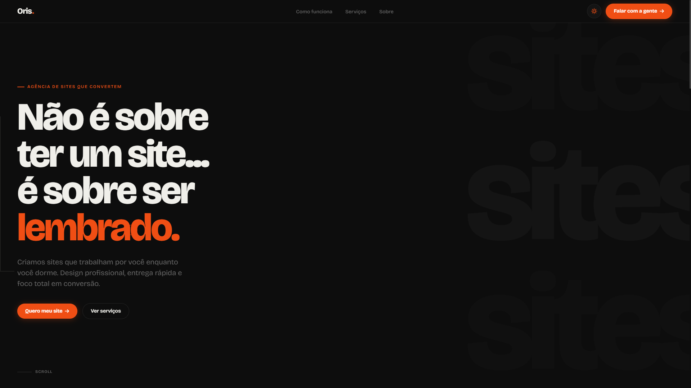

# 🟠 Oris — Sites que geram clientes

Esse é o repositório oficial do **site institucional da Oris**, agência de web design focada em conversão, com sede em São José dos Campos, SP.  
O projeto está **online e em produção** em [orisstudio.com.br](https://www.orisstudio.com.br/).

> *"Não é sobre ter um site... é sobre ser lembrado."*

---

## 📋 Índice

- 📌 Sobre o Projeto
- 🛠 Tecnologias Utilizadas
- 🎨 Identidade Visual
- 🚀 Como Funciona
- 📦 Estrutura do Projeto
- ▶️ Como Executar Localmente

---

## 📌 Sobre o Projeto

O **OrisWeb** é o site institucional da Oris, desenvolvido com foco total em **conversão e experiência do usuário**. O objetivo é apresentar os serviços da agência, gerar contato via WhatsApp e transmitir autoridade e profissionalismo para potenciais clientes no Vale do Paraíba e região.

O site apresenta:

- Proposta de valor clara e direta
- Planos e preços detalhados (Estreia, Autoridade, Referência, Parceria)
- Processo de trabalho simplificado (Briefing → Design & Build → Go Live)
- Seção institucional sobre a Oris
- CTA direto para WhatsApp em todo o fluxo

<p align="center">
  
</p>

---

## 🛠 Tecnologias Utilizadas

Este projeto foi construído com tecnologias front-end puras, sem frameworks:

- HTML5
- CSS3
- JavaScript (Vanilla)
- Git & GitHub

---

## 🎨 Identidade Visual

| Elemento | Valor |
|---|---|
| Tipografia | Bricolage Grotesque |
| Cor primária | `#f04e14` (laranja) |
| Cor base | Preto profundo / Off-white |
| Logo | Tipográfico com ponto laranja |
| Slogan | Sites que geram clientes |

---

## 🚀 Como Funciona

1. O usuário acessa **[orisstudio.com.br](https://www.orisstudio.com.br/)**
2. Navega pelas seções: proposta de valor, processo, planos e sobre
3. É direcionado para contato direto via **WhatsApp** ao clicar em qualquer CTA
4. A Oris inicia o atendimento e o processo de criação do site

---

## 📦 Estrutura do Projeto

```
OrisWeb/
└── src/
    ├── index.html
    ├── assets/
    │   ├── imagem1.png
    │   ├── imagem2.png
    │   └── favicon.ico
    └── static/
        ├── style.css
        └── script.js
```

---

## ▶️ Como Executar Localmente

Por ser um projeto estático, basta clonar e abrir no navegador:

```bash
git clone https://github.com/igorcsouzaa/OrisWeb.git
cd OrisWeb/src
```

Abra o arquivo `index.html` diretamente no navegador ou use uma extensão como o **Live Server** no VS Code.

---

## 🌐 Acesse Online

O site está em produção e pode ser acessado em:

**[https://www.orisstudio.com.br/](https://www.orisstudio.com.br/)**

---

## 📞 Contato

- 💬 WhatsApp: [(12) 99773-6451](https://wa.me/5512997736451)
- 📍 São José dos Campos, SP
- 📸 Instagram: [@orisstudio.com.br](https://www.instagram.com/orisstudio.com.br/)
- 💼 LinkedIn: [orisstudio](https://linkedin.com/company/orisstudio)

---

© 2025 Oris. Todos os direitos reservados.
